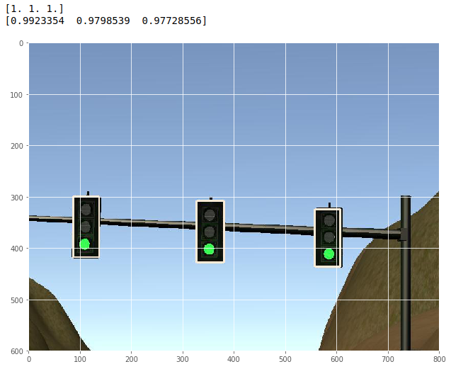
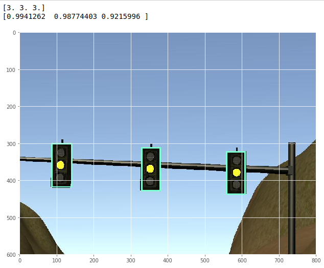
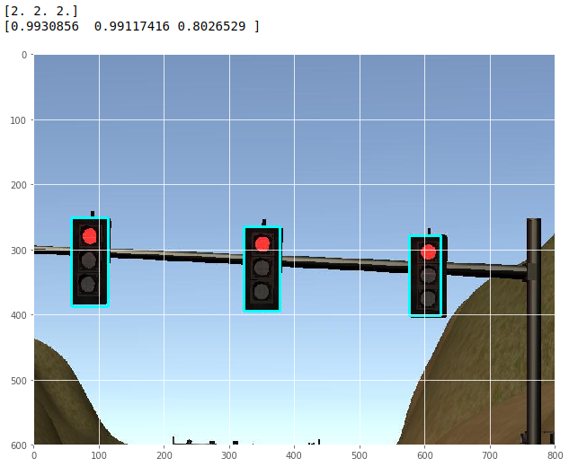

This is the project repo for the final project of the Udacity Self-Driving Car Nanodegree: Programming a Real Self-Driving Car. For more information about the project, see the project introduction [here](https://classroom.udacity.com/nanodegrees/nd013/parts/6047fe34-d93c-4f50-8336-b70ef10cb4b2/modules/e1a23b06-329a-4684-a717-ad476f0d8dff/lessons/462c933d-9f24-42d3-8bdc-a08a5fc866e4/concepts/5ab4b122-83e6-436d-850f-9f4d26627fd9).

Please use **one** of the two installation options, either native **or** docker installation.

### Native Installation

* Be sure that your workstation is running Ubuntu 16.04 Xenial Xerus or Ubuntu 14.04 Trusty Tahir. [Ubuntu downloads can be found here](https://www.ubuntu.com/download/desktop).
* If using a Virtual Machine to install Ubuntu, use the following configuration as minimum:
  * 2 CPU
  * 2 GB system memory
  * 25 GB of free hard drive space

  The Udacity provided virtual machine has ROS and Dataspeed DBW already installed, so you can skip the next two steps if you are using this.

* Follow these instructions to install ROS
  * [ROS Kinetic](http://wiki.ros.org/kinetic/Installation/Ubuntu) if you have Ubuntu 16.04.
  * [ROS Indigo](http://wiki.ros.org/indigo/Installation/Ubuntu) if you have Ubuntu 14.04.
* [Dataspeed DBW](https://bitbucket.org/DataspeedInc/dbw_mkz_ros)
  * Use this option to install the SDK on a workstation that already has ROS installed: [One Line SDK Install (binary)](https://bitbucket.org/DataspeedInc/dbw_mkz_ros/src/81e63fcc335d7b64139d7482017d6a97b405e250/ROS_SETUP.md?fileviewer=file-view-default)
* Download the [Udacity Simulator](https://github.com/udacity/CarND-Capstone/releases).

### Docker Installation
[Install Docker](https://docs.docker.com/engine/installation/)

Build the docker container
```bash
docker build . -t capstone
```

Run the docker file
```bash
docker run -p 4567:4567 -v $PWD:/capstone -v /tmp/log:/root/.ros/ --rm -it capstone
```

### Port Forwarding
To set up port forwarding, please refer to the "uWebSocketIO Starter Guide" found in the classroom (see Extended Kalman Filter Project lesson).

### Usage

1. Clone the project repository
```bash
git clone https://github.com/udacity/CarND-Capstone.git
```

2. Install python dependencies
```bash
cd CarND-Capstone
pip install -r requirements.txt
```
3. Make and run styx
```bash
cd ros
catkin_make
source devel/setup.sh
roslaunch launch/styx.launch
```
4. Run the simulator

### Real world testing
1. Download [training bag](https://s3-us-west-1.amazonaws.com/udacity-selfdrivingcar/traffic_light_bag_file.zip) that was recorded on the Udacity self-driving car.
2. Unzip the file
```bash
unzip traffic_light_bag_file.zip
```
3. Play the bag file
```bash
rosbag play -l traffic_light_bag_file/traffic_light_training.bag
```
4. Launch your project in site mode
```bash
cd CarND-Capstone/ros
roslaunch launch/site.launch
```
5. Confirm that traffic light detection works on real life images

### Other library/driver information
Outside of `requirements.txt`, here is information on other driver/library versions used in the simulator and Carla:

Specific to these libraries, the simulator grader and Carla use the following:

|        | Simulator | Carla  |
| :-----------: |:-------------:| :-----:|
| Nvidia driver | 384.130 | 384.130 |
| CUDA | 8.0.61 | 8.0.61 |
| cuDNN | 6.0.21 | 6.0.21 |
| TensorRT | N/A | N/A |
| OpenCV | 3.2.0-dev | 2.4.8 |
| OpenMP | N/A | N/A |

We are working on a fix to line up the OpenCV versions between the two.

# Udacity-Capstone-Project

In the last udacity project for the self driving car engineer the main topic is system integration. Goal is to implement an algorithm that can handle a test track with traffic lights. Problems that have to be solved are the following:
* wapoint updater - get the relevant waypoints the car should follow
* motion controller - implement a controller that navigates the self driving car along given waypoints
* traffic light detector - implement an alogrithm that detects the state of the traffic light
* behaviour generation - implement a logic that handles traffic light situations

First of all Udacity provided a system sketch of the used architecture that you can see below:


As you can see the above mentioned points are summarized below three major points, perception (get the current environemnt information), planning (act on the given envionment information), control (execute the given behaviour).

In the following steps I will explain how I solved the given problems.

## Waypoint updater
As a first step I started to get the actual route the car should follow. Therefore we were provided by a list of waypoints. To find the relevant waypoints for the ego vehicle I searched with help of the KDTree of the scipy library for the closest waypoint to the current position of the ego vehicle. After finding the closest waypoint I added a specified number of waypoints to generate the future trajectory. This result was then published as final_waypoints on ros.

A first integration check was to open the simulator and see if the given final waypoints were displayed as a green route in the image.

## Motion controller
After the implementation of the final waypoints was verified I started to implement the contoller to follow those waypoints. For the control of the twist I used the provided twist controller by Udacity, for handling the control of throttle and break I used a PID controller. The parameter for the PID controller were choosen by testing multiple values.

Important for the PID controller part was that you disable the PID controller during the time if the steering control was done manually. Otherwise the integrational part would generate some bad behavior as soon as you switch to automated driving again. This was done by subscribing to the vehicle/dbw_enabled (dbw = drive by wire). The control commands where then published via the dbw node.

## Behaviour generation
We have a lane that we have to follow, a controller that takes care of staying on the lane so the last missing part is to react on traffic lights. The simulator is publishing groundtruth data of the traffic light states which are used in the first step for generating the logic for the traffic light behaviour.

So if we detect a red traffic light, we of course want to stop. Therefore we need the traffic light position (given by map data) as well as the state of the light (given by udacity simulator). So first of all we have to find the closest waypoint to the traffic light, which we can achieve by again using the previos mentioned KDTree. Since we don't want to stop our car center directly below the traffic light (the front would reach into the crossing) we substract a given number of waypoints to stop earlier.

Last thing to do is to manipulate the waypoints so that we stop at the previous found waypoint. This is achieved by deaccelerating until the given point. Therefore we used a square root function which increases the brake force when the distance to the traffic light waypoint gets closer.

For a first integration test I subscribed to the ground truth traffic light state and checked if the car was stopping. After the successful implementation of the behaviour generation I focused on implementing a neural network to get the current light state instead of relying on the ground truth simulator data (since in the real car we won't have those data).

## Traffic light detection
For the traffic light detection I choosed a ssd mobilenet from the following link:
https://github.com/tensorflow/models/blob/master/research/object_detection/g3doc/detection_model_zoo.md
SSD neural networks are intresting as soon as you only have limited hardware resources. For example on big cluster (cloud) networks you will not use a SSD network since you have enough hardware power. But in our car we only have limited hardware resources and SSD networks have a great ratio between quality and calculation time. Below you can see a system architecture of a SSD network.


For training the neural network I used the object detection API. Important: Since Udacity is only able to work with tensor flow version 1.3 I also had to downgrade the object detection API to a compatible version.

Training data could be found online from other Udacity students. Thanks for your effort!
https://drive.google.com/file/d/0B-Eiyn-CUQtxdUZWMkFfQzdObUE/view?usp=sharing

Due to limited hardware resources I was only able to train the neural network for the simulation. By using the trained model I was able to achieve the following results:

Traffic Light States:
* 1 - green
* 2 - red
* 3 - yellow
* 4 - unknown

Green Traffic Light:


Yellow Traffic Light:


Red Traffic Light:


Since the traffic light logic was already implemented in the previous step I just had to switch from the groundtruth light state to the neural network state. The result did work quite good but there is still potential to increase the performance and the quality of the network. Especially if the car is standing close to the traffic light the current neural network has some problems to classify the traffic light state correctly.
